# Web Infrastructure Lab — IIS · NGINX · SQL Server · Hyper-V

**A hands-on infrastructure project by Olumide Akomolafe**
*Network Support Technician — Conestoga College (Cambridge, Ontario)*

In this lab I stood up four production-style infrastructure services on the vSphere cluster and proved each one end-to-end: **IIS** on Windows Server 2022 serving three sites with HTTPS, **NGINX** on Rocky Linux serving the same three sites with location blocks, **SQL Server** hosting a loan-tracking database with a scoped application user, and **Hyper-V** running a nested Rocky Linux VM on a Windows host. Every step is captured with the screenshot I took at the time, and the configurations I used are checked in as actual config files in this repo — not just pictures.

---

## The case scenario I built this against

I treated this as an evaluation engagement for a fictional client I'll call **Northwood Devices** — a mid-size training-and-loaner-equipment organisation who needed to answer four questions before committing to a platform:

1. **Can we serve our internal portal off Windows IIS** with HTTPS terminated by a self-signed cert (cost-free) and two virtual directories for departmental sub-sites?
2. **Can we serve the same shape of site off Linux NGINX** at parity, so we have a fallback if Windows licensing changes their pricing?
3. **Can we host the device-loans database** on SQL Server with a properly-scoped application user — no shared admin password, no over-permissioned role?
4. **Can we consolidate older physical hosts** onto a Hyper-V box by running a nested Rocky VM as proof-of-concept?

The answer in each case was yes — and the proof is in the screenshots and configs below.

---

## The infrastructure I built

| VM | OS | IP | Role |
|---|---|---|---|
| `oakomolafe6433-IIS` | Windows Server 2022 | `.240` | IIS host — HQ, Logo, Music sites |
| `oakomolafe6433-NGINX` | Rocky Linux | `.241` | NGINX host — same three sites |
| `oakomolafe6433-SQL` | Windows Server 2022 + SQL Server | `.242` | SQL Server — device-loans DB |
| `oakomolafe6433-HyperV` | Windows Server 2022 (Hyper-V enabled) | `.243` | Hyper-V host + nested Rocky VM |

All four VMs were deployed from templates on the ACSIT vSphere cluster with static IPs assigned at provisioning. The `oakomolafe6433-` prefix is the lab tag I used during the build.

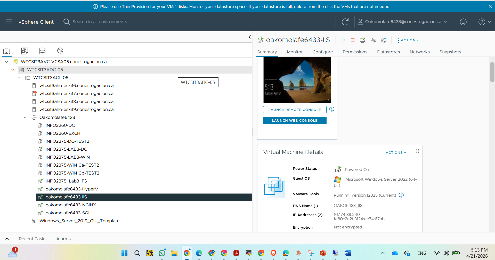
*The IIS server registered in vSphere.*

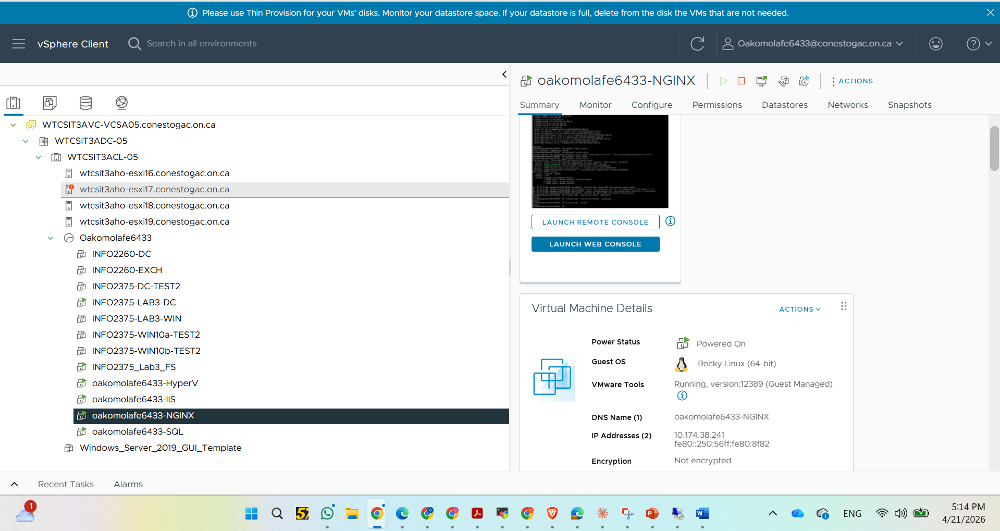
*The Rocky Linux NGINX server.*

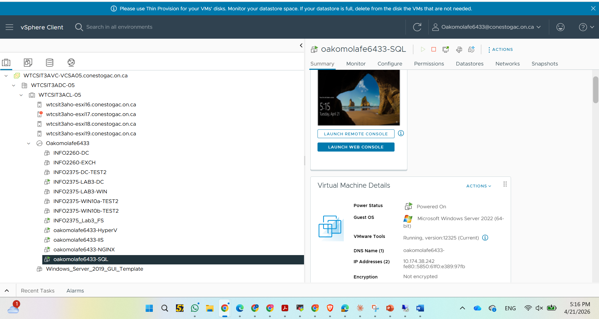
*The SQL Server VM.*

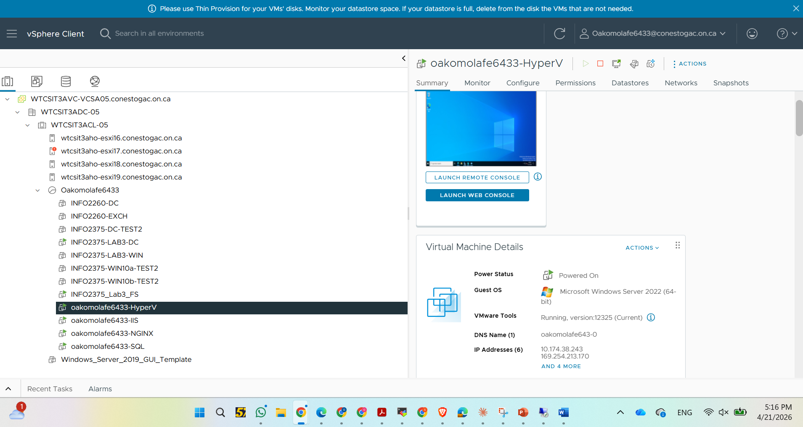
*The Hyper-V host VM. Hyper-V on a vSphere VM is nested virtualization — Hyper-V is the guest hypervisor inside a vSphere guest.*

---

## Stage 1 — IIS on Windows Server 2022 (Question 1)

On the IIS host I installed the **Web-Server role with the management console** and created three content folders under `C:\inetpub\`:

```
C:\inetpub\
├── oakomolafe6433HQsite\
├── oakomolafe6433Logo\
└── oakomolafe6433Music\
```

Each folder got a small `index.html`. I pointed the Default Web Site at the HQ folder and exposed the other two as **IIS Virtual Directories** under the default site — so `http://server/oakomolafe6433Logo` resolves to the Logo folder without me having to spin up a second site or a second port.

The full PowerShell that reproduces this build is checked in at [`iis/setup.ps1`](./iis/setup.ps1).

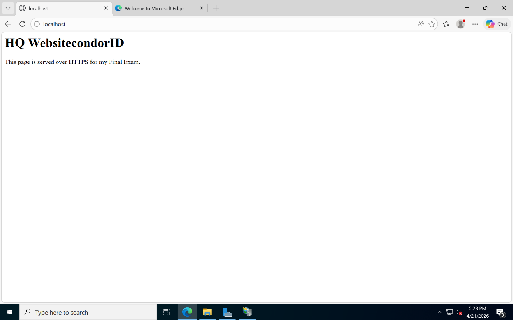
*The Default Web Site, rebound to `oakomolafe6433HQsite`, answering at `http://localhost`.*

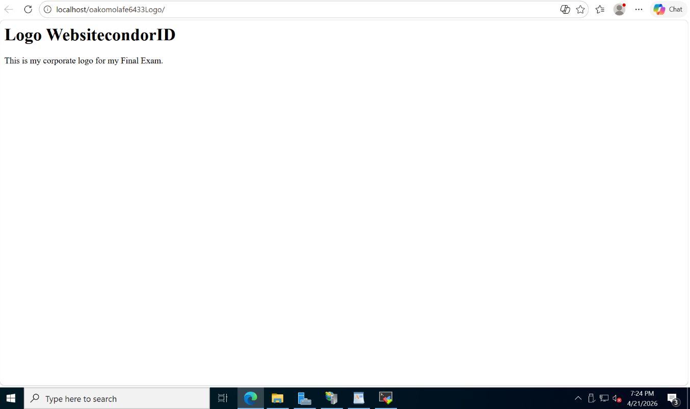
*The Logo virtual directory.*


*The Music virtual directory.*

### HTTPS with a self-signed certificate

I generated a self-signed certificate with `New-SelfSignedCertificate`, bound it to port 443 on the Default Web Site, and confirmed `https://localhost` came back with the expected page over TLS.

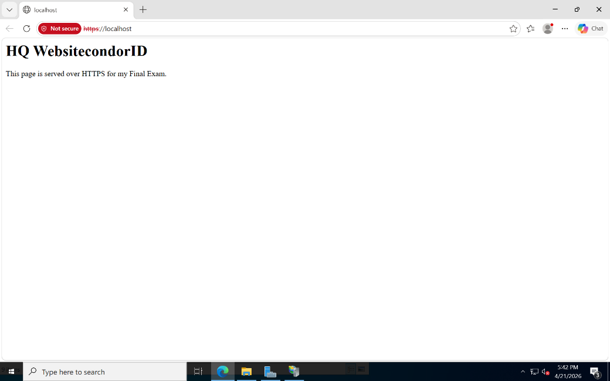
*HTTPS access. The browser shows a self-signed warning (expected) and serves the HQ site once accepted.*

**Why a self-signed certificate is fine here.** For an internal portal accessed by domain machines, a self-signed cert pushed via GPO to the trusted-root store gives encryption-in-transit with zero cost. In production with public users you'd use AD Certificate Services for an internal CA, or a public cert from an ACME provider. The IIS binding work is identical — only the cert source changes.

---

## Stage 2 — NGINX on Rocky Linux (Question 2)

On the Rocky host I installed NGINX, enabled the service on boot, opened the firewall for HTTP and HTTPS with `firewall-cmd`, and created three content folders under `/usr/share/nginx/`:

```
/usr/share/nginx/
├── oakomolafe6433HQ/
├── oakomolafe6433Logo/
└── oakomolafe6433Music/
```

I gave the `nginx` service account ownership of all three with `chown -R nginx:nginx` and `chmod -R 755`, then **commented out the default `server { ... }` block** in `/etc/nginx/nginx.conf` so the default Rocky welcome page didn't shadow my HQ site at `/`.

The site itself is one virtual host with **two `location` blocks** for the Logo and Music paths, both rooting back to `/usr/share/nginx/`. The full config is checked in at [`nginx/condorid.conf`](./nginx/condorid.conf), and the reproducible setup script is at [`nginx/setup.sh`](./nginx/setup.sh).

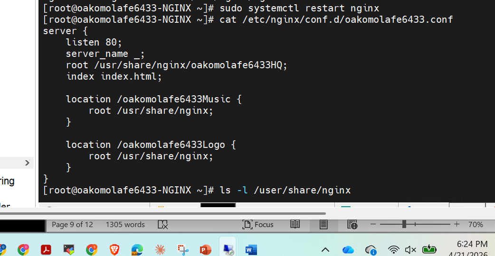
*`cat /etc/nginx/conf.d/condorid.conf` — the working virtual host with both location blocks.*

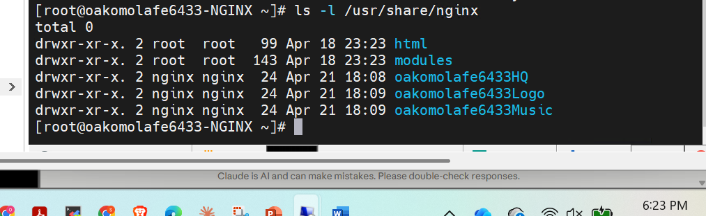
*`ls -l /usr/share/nginx` — the three content folders with `nginx:nginx` ownership.*

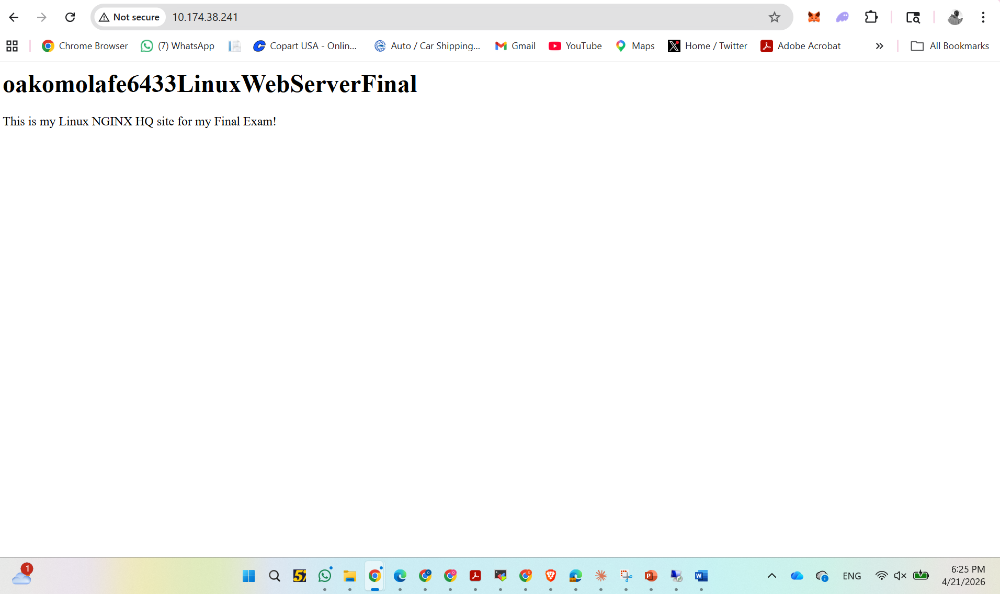
*The HQ site at `http://ServerIP`.*

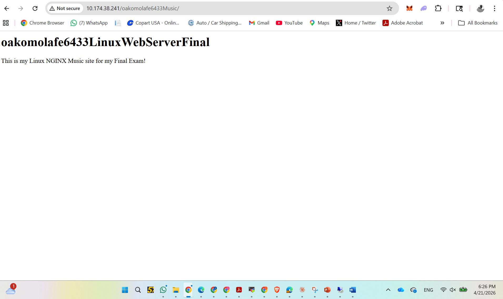
*The Music location at `http://ServerIP/oakomolafe6433Music`.*

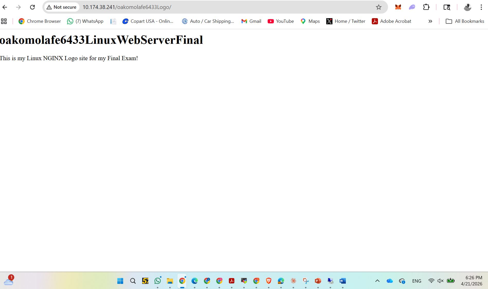
*The Logo location at `http://ServerIP/oakomolafe6433Logo`.*

**The pattern is the same across IIS and NGINX**: a default site that resolves at `/`, two named sub-locations as either virtual directories (IIS) or location blocks (NGINX). I can hand the same content tree to either platform.

---

## Stage 3 — SQL Server with a scoped application user (Question 3)

On the SQL Server VM I created the `oakomolafe6433-LoanDB` database, defined the `oakomolafe6433-DeviceLoans` table, and seeded it with five realistic loan records — two device types (Laptop and Tablet), two loan durations (7 and 14 days).

The schema is intentionally minimal — five columns, one primary key. The whole point of this stage was to demonstrate I can write the **read patterns**, the **write patterns**, and a **scoped application user** correctly.

Every query in this stage is checked into the [`sql/`](./sql) folder so you can read them as files rather than scroll a long README:

| File | What it does |
|---|---|
| [`sql/01-create-database.sql`](./sql/01-create-database.sql) | `CREATE DATABASE` |
| [`sql/02-create-table.sql`](./sql/02-create-table.sql) | Five-column schema with `LoanID` as PK |
| [`sql/03-seed-data.sql`](./sql/03-seed-data.sql) | Five seed rows with realistic names and tags |
| [`sql/04-read-queries.sql`](./sql/04-read-queries.sql) | `SELECT *`, projection, `WHERE`, `ORDER BY` |
| [`sql/05-write-queries.sql`](./sql/05-write-queries.sql) | `UPDATE` and `DELETE` by primary key |
| [`sql/06-create-login-and-user.sql`](./sql/06-create-login-and-user.sql) | Server login + database user + `GRANT SELECT, INSERT` only |

**The login is deliberately narrow.** I granted `SELECT` and `INSERT` only — no `UPDATE`, no `DELETE`, no DDL. An application that reads loans and adds new ones doesn't need anything else. If a developer later asks for `UPDATE`, that's a conversation about *why*, not a default-yes.

In production the password lives in a secrets manager (Key Vault, AWS Secrets Manager) and rotates. The lab brief used a literal string — I've called that out in the SQL file's comment block so nobody mistakes it for a recommendation.

---

## Stage 4 — Hyper-V with a nested Rocky VM (Question 4)

On the Hyper-V VM (itself a guest of vSphere — this is **nested virtualization**) I installed the **Hyper-V role**, created an `ExternalvSwitch` bound to the PROD network adapter so the nested VM can reach the LAN directly, and built a Generation-2 VM called `oakomolafe6433RockyFinal`:

- Generation 2 (UEFI)
- 1024 MB RAM
- Networked through the External vSwitch
- 40 GB virtual hard disk
- Rocky Minimal ISO mounted
- Secure Boot disabled (Rocky's bootloader isn't signed with the Microsoft UEFI CA by default)

I installed Rocky inside that VM, configured it with a static IP on the same subnet (`.254`), gateway `.1`, and DNS pointing at the lab DNS server, and confirmed I could sign in.

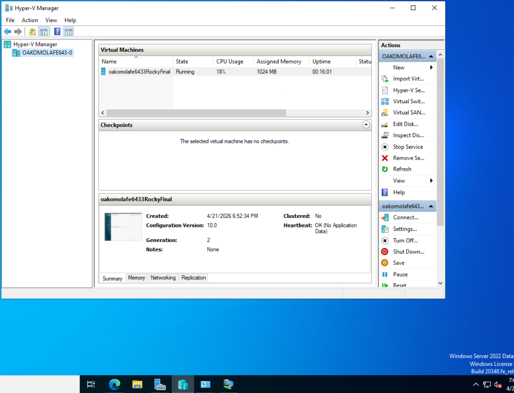
*Hyper-V Manager showing the role is installed and the nested VM is registered.*

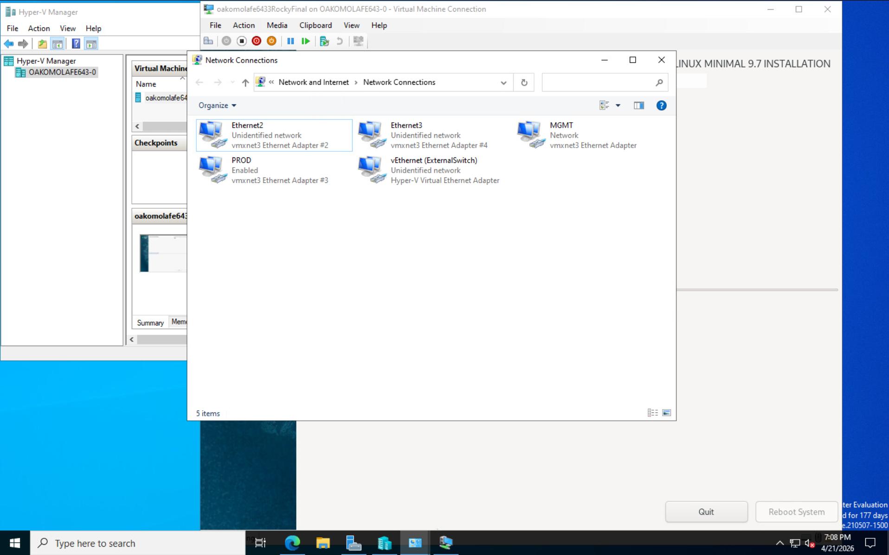
*The Hyper-V host's adapters, with the External vSwitch bound to the PROD adapter.*

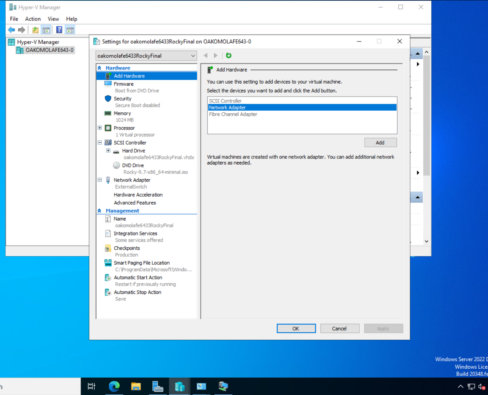
*The Rocky VM configuration in Hyper-V Manager — Gen 2, 1 GB RAM, External vSwitch.*

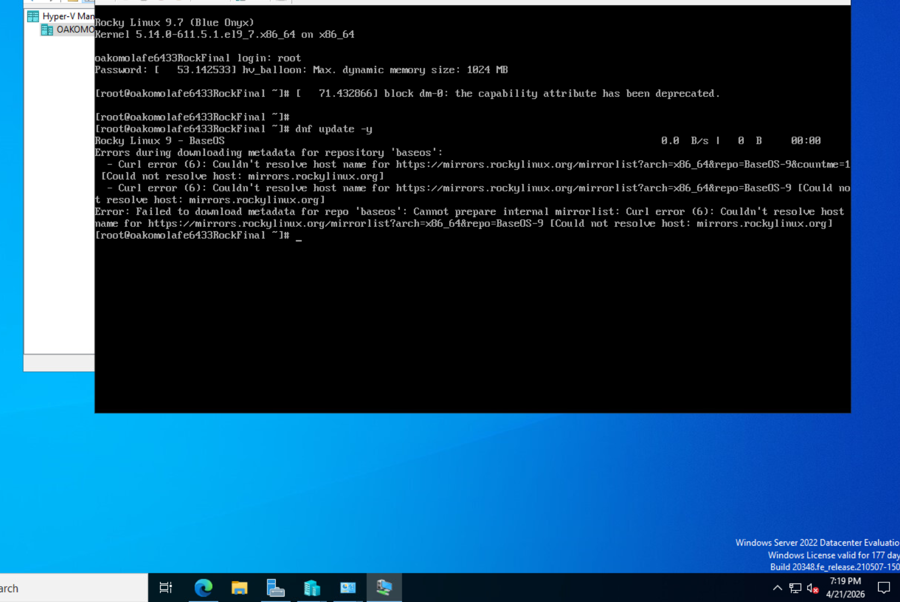
*The nested Rocky VM, fully booted, signed in as root.*

**Why Secure Boot off, and what it means.** Generation-2 Hyper-V VMs use UEFI and Secure Boot by default, which only trusts bootloaders signed by Microsoft's UEFI CA. Rocky's bootloader is signed for x86 BIOS boot but not by Microsoft. In a real deployment I'd choose between (a) keeping Secure Boot on and providing a Microsoft-CA-signed Rocky boot image, or (b) turning Secure Boot off, which is acceptable for an internal-only nested test VM but not what I'd recommend for an internet-facing workload.

**Why nested virtualization at all.** It validates a real consolidation pattern: an old physical box that's hosting one or two workloads can be retired by lifting its OS into a Hyper-V guest on a newer host. The nested test here is the proof that the Hyper-V host configuration is correct before doing the real lift.

---

## Skills I'm demonstrating in this repo

**Windows infrastructure (IIS)** — IIS role install, Default Web Site rebinding, virtual directories, self-signed certificate generation, HTTPS port-443 binding, PowerShell-scripted setup.

**Linux infrastructure (NGINX)** — `dnf` package install, `systemctl enable --now`, `firewall-cmd` zone configuration, single-virtual-host pattern with location blocks, file ownership for the service account, `nginx -t` validation before reload.

**SQL Server** — database and schema creation, projection / filter / sort patterns, parameterised seed data, role-based access with `CREATE LOGIN` and a scoped `GRANT SELECT, INSERT`.

**Hyper-V virtualization** — Hyper-V role install on a Windows Server host, External vSwitch bound to a physical adapter, Generation-2 VM with UEFI, Secure Boot trade-off explained, nested virtualization for hardware consolidation.

**Cross-platform thinking** — IIS and NGINX serving the same site shape side-by-side, so the team has a Windows or Linux deployment option without rewriting content.

---

## What's in this repo

```
web-infrastructure-iis-nginx-sql-lab/
├── README.md             ← you are here
├── .gitignore
├── iis/
│   ├── setup.ps1         ← reproducible IIS build script
│   └── index.html        ← sample HQ page
├── nginx/
│   ├── setup.sh          ← reproducible NGINX build script
│   └── condorid.conf     ← the virtual host config I deployed
├── sql/
│   ├── 01-create-database.sql
│   ├── 02-create-table.sql
│   ├── 03-seed-data.sql
│   ├── 04-read-queries.sql
│   ├── 05-write-queries.sql
│   └── 06-create-login-and-user.sql
└── screenshots/          ← 17 screenshots from the live build
```

The 17 screenshots are every milestone of the build, named in build order. Each one was captured against a live VM running on the vSphere cluster.

---

## My companion projects

| Repo | What's in it |
|---|---|
| [**windows-ad-infrastructure-lab**](https://github.com/) | Companion lab — Windows Server 2019 domain, AD DS, DHCP, DNS, file shares with NTFS least-privilege, GPO drive mapping |
| [**qvis-network-portfolio**](https://github.com/) | A complete small-business multi-VLAN network in Cisco Packet Tracer with a four-part video walkthrough |
| [**qvis-aws-portfolio**](https://github.com/) | AWS cloud architecture for the QVIS Quick Vehicle Insurance System (Lagos State MVAA) |

---

## Contact

**Olumide Akomolafe**
Cambridge, Ontario · Network Support Technician
I'm actively looking for Tier-1 and Tier-2 Network Support roles in Ontario.
